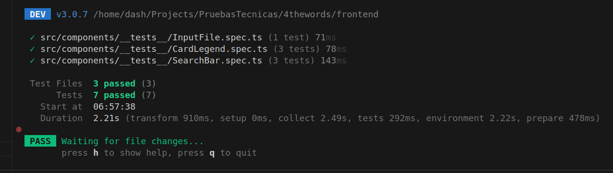

# Legend

Este proyecto es una aplicación web desarrollada con Vue 3 y Vite. La aplicación permite gestionar leyendas, incluyendo la visualización y edición de detalles.

## Tecnologías Principales

- **Vue 3**: Un framework progresivo de JavaScript para construir interfaces de usuario.
- **Vite**: Un entorno de desarrollo rápido y moderno para proyectos de frontend.
- **TypeScript**: Un superconjunto de JavaScript que añade tipos estáticos.
- **Tailwind CSS**: Un framework de CSS para un diseño rápido y eficiente.
- **Vue Router**: Un enrutador oficial para Vue.js que permite la navegación entre vistas.
- **Pinia**: Un almacén de estado para Vue.js.
- **Vitest**: Un framework de pruebas unitarias para proyectos de Vite.
- **Playwright**: Una herramienta para pruebas end-to-end.

## Configuración Recomendada del IDE

[VSCode](https://code.visualstudio.com/) + [Volar](https://marketplace.visualstudio.com/items?itemName=Vue.volar) (y desactivar Vetur).

## Soporte de Tipos para Importaciones de `.vue` en TS

TypeScript no puede manejar información de tipos para importaciones de `.vue` por defecto, por lo que reemplazamos la CLI `tsc` con `vue-tsc` para la comprobación de tipos. En los editores, necesitamos [Volar](https://marketplace.visualstudio.com/items?itemName=Vue.volar) para que el servicio de lenguaje de TypeScript sea consciente de los tipos de `.vue`.

## Estructura del Proyecto

La estructura de carpetas del proyecto es la siguiente:

```plaintext
├── e2e
│   ├── tsconfig.json
│   └── vue.spec.ts
├── env.d.ts
├── eslint.config.ts
├── index.html
├── package.json
├── playwright.config.ts
├── pnpm-lock.yaml
├── public
│   ├── demo
│   │   ├── data
│   │   │   ├── legends.json
│   │   │   ├── list-of-canton.json
│   │   │   ├── list-of-categories.json
│   │   │   ├── list-of-district.json
│   │   │   └── list-of-province.json
│   │   └── images
│   │       └── avatar
│   │           └── avatar-m-3@2x.png
│   └── favicon.ico
├── README.md
├── src
│   ├── App.vue
│   ├── assets
│   │   ├── base.css
│   │   ├── logo.svg
│   │   └── main.css
│   ├── components
│   │   ├── CardLegend.vue
│   │   ├── SearchBar.vue
│   │   ├── __tests__
│   │   │   ├── CardLegend.spec.ts
│   │   │   ├── InputFile.spec.ts
│   │   │   └── SearchBar.spec.ts
│   │   └── ui
│   │       ├── BaseButton.vue
│   │       ├── index.ts
│   │       ├── InputFile.vue
│   │       ├── InputSelect.vue
│   │       ├── InputText.vue
│   │       └── TextArea.vue
│   ├── composables
│   │   ├── useConfirmDelete.ts
│   │   ├── useSwal.ts
│   │   └── useTheme.ts
│   ├── layouts
│   │   └── MainLayout.vue
│   ├── main.ts
│   ├── router
│   │   └── index.ts
│   ├── schemas
│   │   └── legends.ts
│   ├── service
│   │   ├── index.ts
│   │   ├── legends-service-demo.ts
│   │   ├── legends-service.ts
│   │   └── list-service.ts
│   ├── settings
│   │   ├── env-vars.ts
│   │   └── index.ts
│   ├── shims-vue.d.ts
│   ├── stores
│   │   └── index.ts
│   ├── utils
│   │   ├── debounce.ts
│   │   ├── index.ts
│   │   └── json-to-formdata.ts
│   └── views
│       ├── FormView.vue
│       └── MainView.vue
├── tailwind.config.js
├── tsconfig.app.json
├── tsconfig.json
├── tsconfig.node.json
├── tsconfig.vitest.json
├── vite.config.ts
└── vitest.config.ts
```

## Personalizar la Configuración

Consulta la [Referencia de Configuración de Vite](https://vite.dev/config/).

## Configuración del Proyecto

Crea un archivo [.env](http://_vscodecontentref_/8) basado en [.env.example](http://_vscodecontentref_/9) y actualiza las variables de entorno según sea necesario:

```sh
cp .env.example .env
```

```sh
pnpm install
```

### Compilar y Recargar en Caliente para Desarrollo

```sh
pnpm dev
```

La aplicación se ejecutará en el puerto 3000 por defecto en tu entorno local.
Puedes acceder a ella en [localhost:3000](http://localhost:3000).

### Comprobar Tipos, Compilar y Minificar para Producción

```sh
pnpm build
```

### Ejecutar Pruebas Unitarias con [Vitest](https://vitest.dev/)

```sh
pnpm test:unit
```

### Resultado de los tests



### Ejecutar Pruebas End-to-End con [Playwright](https://playwright.dev)

```sh
# Instalar navegadores para la primera ejecución
npx playwright install

# Al probar en CI, se debe compilar el proyecto primero
pnpm build

# Ejecutar las pruebas end-to-end
pnpm test:e2e
# Ejecutar las pruebas solo en Chromium
pnpm test:e2e --project=chromium
# Ejecutar las pruebas de un archivo específico
pnpm test:e2e tests/example.spec.ts
# Ejecutar las pruebas en modo debug
pnpm test:e2e --debug
```

### Lint con [ESLint](https://eslint.org/)

```sh
pnpm lint
```

## Vistas del Proyecto

La aplicación tiene las siguientes vistas:

1. **MainView**: La vista principal que muestra una lista de leyendas. Permite buscar y filtrar leyendas.
2. **FormView**: Una vista de formulario que permite crear o editar una leyenda existente. Se accede a esta vista desde la vista principal.

Cada vista está configurada en el enrutador de la aplicación en [src/router/index.ts](src/router/index.ts).
